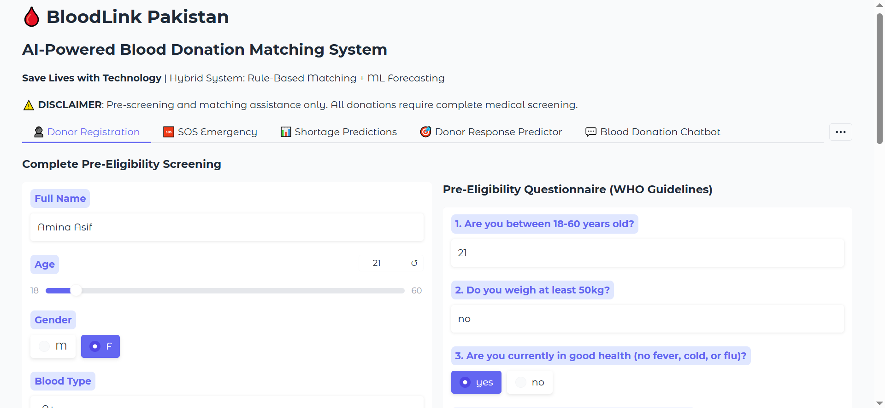
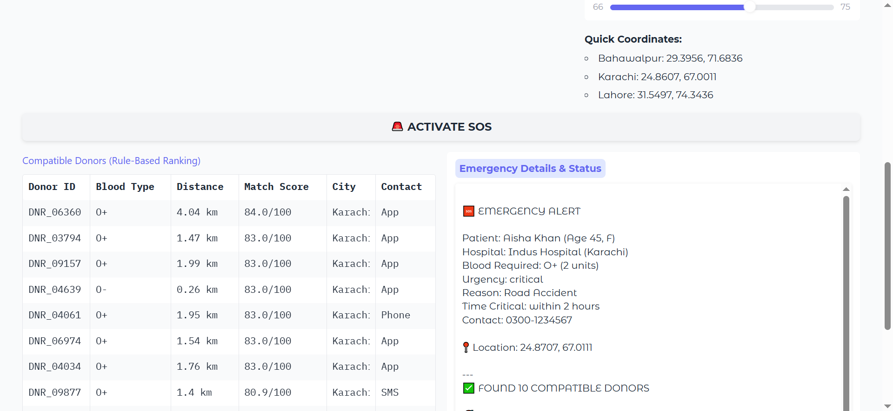
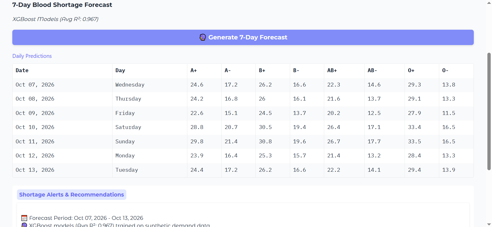
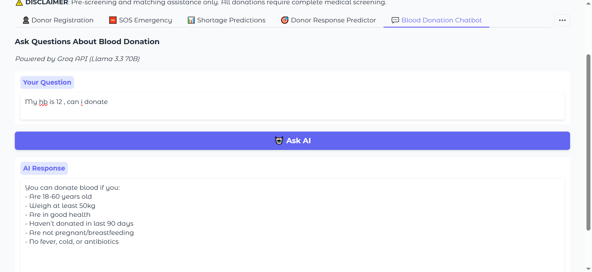

# BloodLink Pakistan

**A rule-based donor-matching, XGBoost shortage-forecasting and chatbot prototype for blood donation, built on synthetic data**

[](https://www.python.org/)
[](https://bloodlink-pakistan-b3a28.containers.snapdeploy.app/)

Gradio web app that ranks nearby compatible blood donors for an emergency request, forecasts 7-day blood demand per blood type with XGBoost, pre-screens donor eligibility, and answers donation questions with a Groq-hosted Llama 3.3 chatbot, **together with an honest account of what its reported numbers do and do not mean**.

> **Please read this first.** Every dataset in this project is **synthetic**: the 10,000 donors, the 12,000 daily demand records, the emergency patients and the hospital stock levels were all generated by code. The reported "response rate" and forecast R² therefore measure how well the system recovers rules that the generator itself used, **not** how it would perform with real donors or hospitals. It is a demonstration of the design, not a validated system.

---

## Contents

1. [Repository layout](#repository-layout)
2. [What the project does](#what-the-project-does)
3. [Main results and how to read them](#main-results-and-how-to-read-them)
4. [How the matching score works](#how-the-matching-score-works)
5. [Run it locally](#run-it-locally)
6. [Deploy](#deploy)
7. [Data](#data)
8. [Limitations](#limitations)
9. [Future work](#future-work)
10. [Authors and credits](#authors-and-credits)
11. [Disclaimer](#disclaimer)

---

## Repository layout

```
Bloodlink-Pakistan/
├── README.md                this file
├── app.py                   the complete Gradio app (data generation, models, UI)
├── requirements.txt         pinned Gradio plus the Python dependencies
├── artifacts/               pre-trained models and generated data (loaded at start-up)
├── BLOODLINK_clean.ipynb    original Colab notebook (API key removed)
├── BloodLink_Presentation.pptx   course presentation (Deep Learning, 29 Dec 2025)
└── screenshots/             app screenshots used in this README
```

`app.py` loads the pre-trained XGBoost models and the generated data from `artifacts/`, so start-up takes a few seconds. If `artifacts/` is missing or incomplete, the app regenerates the data, retrains the eight models (about 30 seconds) and saves them again. To retrain on purpose, delete the `artifacts/` folder. Seeds are fixed at 42.

---

## What the project does

- **Emergency donor matching (SOS).** Given a blood type and a location, the app keeps donors with a compatible type within 25 km and ranks them with a transparent six-rule score. Emergency mode weights distance more heavily.
- **Shortage forecasting.** One XGBoost regressor per blood type predicts daily demand for the next 7 days from calendar features, three lag values and a 7-day rolling mean, and flags days predicted below 5 units.
- **Donor response predictor.** Shows the score breakdown for a donor profile and converts it to a rough priority level.
- **Pre-eligibility questionnaire.** Nine WHO-style questions (age, weight, recent donation, chronic conditions, tattoos, malaria-risk travel, haemoglobin and so on) give an eligibility result and score. It is pre-screening only.
- **Chatbot.** Answers donation questions (eligibility, frequency, Ramadan, halal status, process) with Llama 3.3 70B through the Groq API. Without an API key it falls back to a keyword-based answer set.
- **Gamification and inventory.** Points and badges per donor (First Drop, LifeSaver, Hero) and an editable hospital stock table.

---

## Screenshots








-->

---

## Main results and how to read them

| # | Result | How to read it |
|---|--------|----------------|
| 1 | Simulated donor response rate **about 76%** (76.2% in the notebook run of 500 simulated emergencies, top 10 donors each; the app recomputes it over 200 at start-up) | The "true" response probability is generated from the same ingredients the score uses (recency, history, contact method, health), so the score is partly recovering its own generator. Treat it as a sanity check, not as real-world accuracy |
| 2 | Shortage forecast: mean R² **0.96-0.97** (0.964 in the notebook), MAE **about 0.95** requests/day (chronological 80/20 split, per blood type) | The demand series was built from a formula (base level, blood-type offset, weekend, seasonal and weekly cycles, Ramadan bump, small noise). A high R² shows the model learns that formula, not that real demand is this predictable |
| 3 | Matching is fully explainable | Each recommendation comes with a point breakdown per rule; no black-box model is involved in ranking |
| 4 | Average distance to contacted donors is a few kilometres in dense cities | Donors are placed within about 9 km of seven city centres, so distances are short by construction |

The exact numbers shown in the **About** tab of the app are recomputed at every start-up and vary slightly with the random draws.

**What we do not claim:** that this system has been tested with real donors, blood banks or hospitals; that the forecast reflects real Pakistani blood demand; that the eligibility questionnaire replaces medical screening; or anything about the chatbot beyond the fact that it is a general-purpose language model given a short safety-oriented prompt.

---

## How the matching score works

| Rule | Points | Based on |
|------|-------:|----------|
| Distance | 0-40 | straight-line distance to the patient (under 2 km scores highest) |
| Donation history | 0-25 | number of past donations |
| Recency | 0-20 | days since last donation |
| Contact method | 0-8 | App > SMS > Phone |
| Health status | 0-5 | Healthy / Minor issues / Unhealthy |
| Urban bonus | 0-2 | donor lives in a large city |

In emergency mode the final score is `0.7 x total + 0.5 x distance points`. Blood-type compatibility uses the standard donor-to-recipient matrix.

---

## Run it locally

```bash
git clone https://github.com/AminahAsif/Bloodlink-Pakistan.git
cd Bloodlink-Pakistan
pip install -r requirements.txt
python app.py
```

Open the local address printed in the terminal. To enable the Groq chatbot, set an environment variable before starting (never put the key in the code or the repository):

```bash
# Windows (Command Prompt)
set GROQ_API_KEY=your_key_here
# Linux / macOS
export GROQ_API_KEY=your_key_here
```

---

## Deploy

Any host that runs a Python web process works (for example a free container host such as SnapDeploy).

1. Push this repository, including the `artifacts/` folder, to GitHub.
2. Create a web service from the repository. Build: `pip install -r requirements.txt`. Start: `python app.py`.
3. Set the environment variable `GROQ_API_KEY` (your key) in the host's dashboard. The app reads the port from `PORT` and listens on `0.0.0.0`.

Free instances usually sleep after some idle time, so the first request after a pause can take a minute or more to load.

---

## Data

All data are generated by `app.py` (and stored in `artifacts/` after the first run); nothing is downloaded and no personal information is used.

| Table | Size | Contents |
|-------|-----:|----------|
| Donors | 10,000 | blood type (skewed towards O+, B+, A+), age, gender, city and coordinates, history, recency, contact method, health status |
| Daily demand | 12,000 | 1,500 days x 8 blood types, ending 31 Dec 2025 |
| Emergency patients | 2 | hand-written examples (Karachi, Lahore) |
| Hospital inventory | 5 hospitals | hand-written stock levels, editable in the app |

---

## Limitations

Entirely synthetic data; donors exist only in seven cities (Bahawalpur appears in the hospital list but has no generated donors, so a Bahawalpur-centred SOS search finds nobody); straight-line distances rather than road travel time; scoring weights chosen by hand and not tuned or validated against real responses; one forecasting model family and no uncertainty intervals; inventory and gamification are held in memory and reset when the app restarts; the app has no user accounts, consent flow or privacy controls, which a real donor registry would need.

---

## Future work

| Phase | Plan |
|-------|------|
| 1 (about 3 months) | Backend integration (PostgreSQL, REST APIs) so donors, inventory and points persist |
| 2 (about 6 months) | Real pilot with 2-3 hospitals and an SMS gateway, the first step that can test whether prioritised contact actually raises donor response |
| 3 (about 12 months) | Mobile app and Urdu interface |
| 4 (18+ months) | Wider expansion with institutional partners |

These are plans, not completed work.

---

## Authors and credits

**Amina Asif** and **Kasa-e-Fatima**, Department of Artificial Intelligence, The Islamia University of Bahawalpur, Bahawalpur, Pakistan.

Course project for Deep Learning, supervised by Prof. Dr. Ghulam Gilanie (presented 29 December 2025).

Built with [Gradio](https://www.gradio.app/), [XGBoost](https://xgboost.ai/), [scikit-learn](https://scikit-learn.org/), [GeoPy](https://geopy.readthedocs.io/) and the [Groq](https://groq.com/) API.

---

## Disclaimer

This is research code and an academic prototype built on synthetic data. It is **not a medical device and not validated for real blood-donor matching, emergency response or hospital planning**. All donations require complete medical screening at certified centres, and nothing in this app or its chatbot is medical advice.
